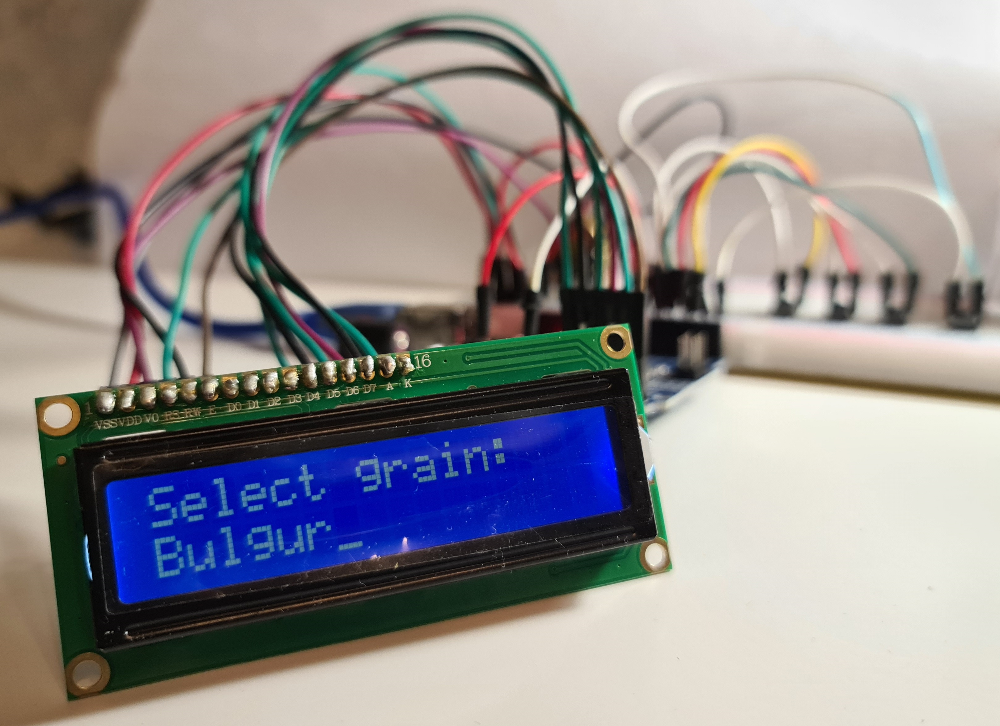

<h1 align="center">
 Smart Scale for Determining 

 the Perfect Ratio of Grain-to-Water
</h1>
Designed the smart scale where user can choose the type of grain, the number of adult servings, and the portion size per calory amount. As a result, the smart scale calculates the required amount of grain and water, and approximate cooking time.

The main aim is achieved by dividing the expected design into two devices. 
* The first device allows user to select the type of grain, the number of servings, and the portion size, as a result user receives the required amount of grain and water, and cooking time. The first program also recalculates water, when different grain amount is placed on the scale, and shows the amount of grain or water that is left to place on the scale. This is illustrated by Tinkercad simulator.
* Second device, programmed in Arduino IDE, is a scale, and allows to measure the weight of grain or water and reset the weight on the scale.

## Introduction
The scale is one of the most required tools in the kitchen. It assists to measure ingredients in cooking process. Most of contemporary types of scales are digital scales. Nevertheless, they lack some smart features such as guiding how much of an ingredient to add, showing cooking time, choosing the number of portions and the amount of calory. Thus, this project aims to design a smart scale to show the perfect ratio of grain-to-water and cooking time with features to choose the number of servings and the calory amount. Grains are part of most types of meals, hence well-known types of grains are selected for the smart scale. Moreover, grains are beneficial to health, since they decrease a risk of heart diseases, diabetes, colorectal cancer, and helps to lower bodyweight, blood pressure, and cholesterol, etc.

The smart scale eases the cooking process of grains by calculating the perfect ratio of grain-to-water after selecting the type of grains, number of servings, and portion size. As a result, user gets the required amount of grain, water, and the appropriate cooking time. The smart scale prompts users, who have no background in cooking, on how much of ingredient is needed and how long to cook grains. For experienced cooks, it diminishes the necessity of bothersome remembering grainto-water ratios, and offers variety of grains, i.e. rice, amaranth, millet, quinoa etc. since grains are the type of food that needs mostly measuring accuracy while cooking. Finally, the smart scale allows to monitor calory information in order to increase calory awareness which promotes healthy cooking.

## Methodology
### Data Collection
Since numerical data can be adjusted in the code, the information about the grain types, calory amount, grain-to-water ratios, and cooking time were taken from some popular cooking websites. Following data was collected and used in the main code without the scale:

  

### Calculation
The number of servings is from 1 to 10 adults (N = 1, 2, 3, . . . , 10). 5 different options of portion sizes in grams were chosen as P = 60, 80, 100, 120, 140. After selecting N and P, required grain amount was formulated by G = N * P (grams) equation. Finally, the equation for required water amount was determined by multiplying obtained grain amount by grain-to-water ratio (W = R * G grams).

### Supplementary libraries
Two supplementary libraries were used for the scale code with I2C LCD:
* HX711 library *<HX711_ADC.h>* was downloaded from [here](https://github.com/olkal/HX711_ADC)
* I2C LCD library *<LiquidCrystal_I2C.h>* was obtained from [here](https://github.com/fdebrabander/Arduino-LiquidCrystal-I2C-library)

### Hardware
Hardware components used for each circuit:

  

### Designing the Smart Scale
#### The Main Code
The main code without the scale is given in [MainCode.ino](https://github.com/KamilyaZhailaubayeva/Smart_Scale_CP/blob/main/MainCode.ino). It was written in C-language by Tinkercad simulator. Then, it was uploaded to Arduino Uno board by Arduino IDE software. The main part of the code consists of the setting up the variables, buttons, USART, LCD and the while loop. This loop constantly checks the buttons and received data from the serial monitor by corresponding interrupts. The operation of buttons in the code is shown in the figure below. When the code reaches the type of information to display, it starts receiving data from the serial monitor. The serial monitor simulates the scale. Thus, the number entered to the serial monitor is subtracted from the required amount of grain or water, subsequently LCD shows the remaining amount of grain or water.

  

The scheme of the circuit without the scale is illustrated in the figure below. There are buttons for various purposes: a central button (red), a left button (yellow), a right button (green), and the lowest button (blue). The user starts by pressing the central button: first press is for selecting the grain type; second press is for selecting the serving size; third press is for selecting the portion size; fourth press is for selecting the type of information to display. The left and right buttons show available options, while the lowest button goes back to previous selection type (reverse to what central button does). Finally, there are potentiometer to adjust the brightness of LCD.

  

#### The Scale Code
The scale code is given in [ScaleCode.ino](https://github.com/KamilyaZhailaubayeva/Smart_Scale_CP/blob/main/ScaleCode.ino). It was written in Arduino IDE. Then, it was uploaded to Arduino Uno board. Libraries of HX711 ADC and I2C LCD were used. The main part of the code consists of the setting up the variables, taring button, HX711 ADC, I2C LCD, calibration factor and the loop. The loop constantly renews the weight shown on the display. Taring button is needed to reset the weight on the scale. The calibration of load cell is different for every load cell, thus calibration factor is set for the load cell used in this project. Finally, I2C LCD is simplified version of the display with only 4 pins and built-in potentiometer for the brightness. The scheme of the scale circuit is given in the figure below.

  

The scheme of the final combined circuit is given in the figure below. Previously, buttons were wired to PIND2, PIND3, PIND4 and PIND5 of Arduino Uno. Thus, its available PIND6 and PIND7 were connected to the HX711 ADC.

  

## Results & Discussion
The circuit without the scale was assembled as shown in the figure below.

  

### Testing the Selection Option
Firstly, the functionality of the circuit was tested. For this, some random selection possibility was chosen: bulgur (type of the grain), 2 (number of adults), and 80 to 273 (calory per portion size). The algorithm to reach the chosen selection possibility is: Red button (1 press) “Select grain:” -> Green button (3 presses) or Yellow button (7 presses) “Bulgur” -> Red button (1 press) “Serving size:” -> Green button (1 press) or Yellow button (9 presses) “2” -> Red button (1 press) “Select portion:” -> Green button (1 press) or Yellow button (4 presses) “80g-273cal”. As a result of this algorithm, which was depicted below, the expected selection path was verified to function correctly. Thus, the program is able to select the type of grain, the number of adults, and the calory amount. 

 Selecting the type of grain | Selecting the number of adults | Selecting the calory per portion size
:---------------------------:|:------------------------------:|:--------------------------------------:
    |       |  

### Testing the Calculations
Previous selection option was continued to check calculations and output of the needed amount of grain and water, and appropriate cooking time. Thus, the next algorithm is Red button (1 press) “Required grain: 160 grams” -> Green button (1 press) “Required water: 320 grams” -> Green button (1 press) “Cooking time: 10-15 min”. As a result of this step, which is given in the figure below, the number of adults is N = 2 and the portion size is P = 80 grams. Thus, the required amount of grain is expected to be: G = N * P = 2 * 80 = 160 grams. Depending on the amount of grain user puts on the scale, the required amount of water W = R * G. For bulgur, R = 2, and if user puts the recommended amount of grain, the amount of water is W = 2 * 160 = 320 grams. From the table of collected data above, the approximate cooking time of bulgur is 10-15 minutes. Figures below confirm the expected numbers, hence verifying a correctness of calculations.

 Calculated required amount of grain | Calculated required amount of water | Approximate cooking time
:-----------------------------------:|:-----------------------------------:|:-----------------------------------:
            |            |  

### Testing the Recalculations
To check the ability to recalculate the amount of water, if user puts not recommended amount of grain on the scale, the serial monitor of Tinkercad was used to simulate the work of the scale. It was assumed that user puts 200 grams of grain instead of recommended 160 grams. If user wants to cook more or less amount of grain, user can go back to grain information by pressing Green or Yellow button. The overweight 200– 160 = 40 grams is expected as “-40 grams” on the display. The left figure below confirms this. If we continue to assume that not recommended 200 grams of grain was on the scale, the required amount of water should recalculate the weight. Thus, the amount of water is expected to change to W = 2*200 = 400 grams which can be verified by the right figure below.

 The amount of grain with the overweight | The recalculated amount of required water
:---------------------------------------:|:------------------------------------------:
                 |           

### Testing the Feature to Adjust the Weight
The feature to adjust the weight displayed on the LCD depending on the changes of the weight on the scale was tested. For this, previous step, where 400 grams of water was needed, was continued. “274” was entered to the serial monitor which means that there was 274 grams on the scale, the code calculated the remaining amount. Figure below verifies the result of this change by showing the remaining water to be filled as W = 400 – 274 = 126 grams.

  

### Setting Up the Scale
The assembled circuit of the scale is illustrated in figures below. After putting measuring cup on the scale, the taring button was pressed, and 100 ml of water was weighted. The weight of the water is shown in the right figure below.

 The assembled circuit of the scale | 100 ml of water on the scale
:----------------------------------:|:------------------------------:
            |           

### Testing the Taring Button
The result of taring the weight of the measuring cup is given in the figures below. Thus, taring button is also verified by resetting the weight of measuring cup.

 Measuring cup on the scale | Resetting the weight by a taring button | After resetting the weight 
:--------------------------:|:---------------------------------------:|:---------------------------:
   |                |  

### Testing the Scale
The result of increasing the weight of the water by 100 ml is shown in the figures below. There is decrease by few grams in the weight, since load cell is built for maximum 10 kg and its sensitivity of grams is weaker.

 200 ml of water          | 300 ml of water          
:------------------------:|:-------------------------:
 |  
400 ml of water           | 500 ml of water
 | 

## Conclusion
This project aims to design the smart scale where user may select the type of grain, the number of adult servings, and the portion size per calory amount. As the result, the smart scale will automatically calculate the required amount of grain, the required amount of water, and approximate cooking time. Even though the project could not reach the desired design of the smart scale, main objectives are reached by dividing the final device into two parts. The first part is the main program written in C-language that shows the operation principle of the smart scale, while the second part written in Arduino IDE is the program of the scale.

User can select the type of grain, the number of servings, and the portion size by using the first device, and it will show how much of grain and water is required as well as approximate cooking time. Then, user can proceed to the second device to weight the selected type of grain and water. Additionally, user can reset the weight on the scale by the taring button. Therefore, the main aim of the smart scale is reached by dividing the circuit into two parts, though the desired result was one final device. 

The recalculations of water, when different amount of grain is on the scale, and the display of decreasing the required amount, while more grain or water being put on the scale, with the case of overweight cannot be shown in the hardware, since there is no connection between two devices. However, the first program can achieve given objectives by Tinkercad’s serial monitor to simulate the operation of the smart scale.

## P.S. :black_nib:
Further studying is needed to combine these two parts into the final smart scale. The programfor amicrocontroller is also desired to write in Atmel Studio for better debugging possibilities. Therefore, it is recommended to use Atmega328P board of Atmel Corporation due to the limitations of Arduino Uno board. This project can be implemented by microcontroller programmers for their own consumption as a kitchen smart scale. However, for the mass production of the device, it requires to combine two circuits into one device.
